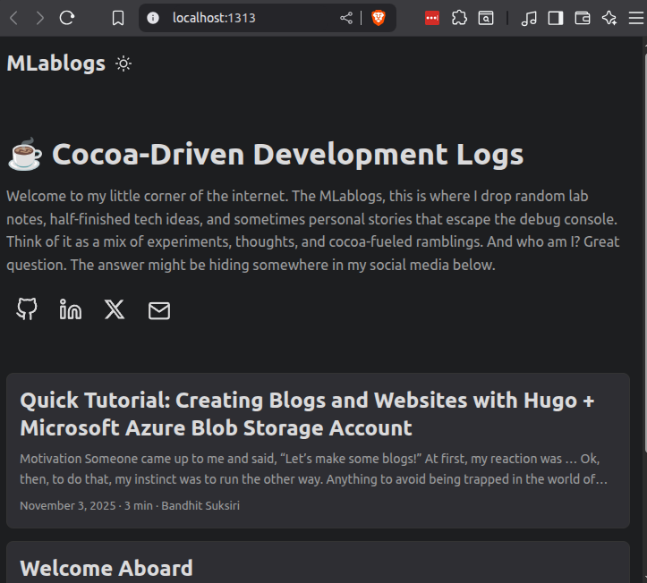

+++
date = '2025-11-02T17:00:00+09:00'
draft = false
title = 'Quick Tutorial: Creating Blogs and Websites with Hugo + Microsoft Azure Blob Storage Account'
+++

## Motivation

Someone came up to me and said, "Let's make some blogs!"
At first, my reaction was ...


Ok, then, to do that, my instinct was to run the other way. Anything to avoid being trapped in the world of WordPress themes or WIX wizardry.
Instead, I dusted off my terminal, grabbed a cup of cocoa, and dove into Hugo-a lightning-fast static site generator that lets me control every pixel.
For hosting, no pricey managed platforms, just a trusty Microsoft Azure Blob Storage account, letting me deploy and update with just a push.
Now, my blog is blazing fast, totally customizable, and blissfully free of cookie-cutter templates.
Who knew building websites could actually be empowering (and kind of fun)?

This tutorial guides you through creating a blog using Hugo,
a fast and flexible static site generator,
and deploying it with Microsoft Azure Blob Storage.

## Prerequisites

- Install Hugo
- Install Git
- Have an active Microsoft Azure account with Blob Storage setup
- Basic command-line and text editor familiarity

### Install Hugo Tips

#### With `snap` (for Ubuntu)

To install Hugo with `snap`, run:

```bash
sudo snap install hugo
```

#### With `mamba` (miniforge system)

Personally, I prefer using mamba for package management across multiple-projects.
Because it's much faster and less prone to dependency resolution issues.
Also, if you’re working in a commercial or government environment,
don’t install Anaconda unless your organization has actually purchased a license—otherwise,
[you could be violating terms of use](https://www.reddit.com/r/Python/comments/iqsk3y/anaconda_is_not_free_for_commercial_use_anymore/).
Community packages like mamba are free for anyone to use without commercial restrictions.

To install Hugo using `mamba` CLI starting from creating a conda environment, you can follow these steps:

Create a new conda environment:

```bash
mamba create -n hugo_env -y
```

Activate the new environment:

```bash
mamba activate hugo_env
```

Install Hugo using mamba from the conda-forge channel:

```bash
mamba install -c conda-forge hugo -y
```

This sequence sets up a mamba environment and installs Hugo efficiently.

## Create a New Hugo Site

Open your terminal and run:

```bash
hugo new site mlablogs
cd mlablogs
git init
```

This sets up a fresh Hugo project.

## Add a Theme

Choose a theme from the Hugo themes repository. For example, add the Ananke theme:

```bash
git submodule add https://github.com/adityatelange/hugo-PaperMod.git themes/PaperMod
echo 'theme = "PaperMod"' >> config.toml
```

You can find more themes on .
You can also change the theme later by editing `config.toml`,
and don't forget to verify your submodules in `.gitmodules` if you need to remove or add more themes.

## Add Content

Create your first blog post:

```bash
mkdir -p content/posts/hello-hugo
nano content/posts/hello-hugo/index.md
```

Edit this Markdown file and add your text.

```md
+++
date = '2025-11-03T12:00:00+09:00'
draft = false
title = 'Hello Hugo'
+++

## Hello Hugo!

Hello Hugo!
```

## Preview Locally

Run:

```bash
hugo server
```

Visit `http://localhost:1313` to see your site live locally.



Very simple, isn’t it?

## Build the Site

Generate static files:

```bash
hugo
```

Static files output to the `public` directory.

## Deploy to Azure Blob Storage

- Create a Blob Storage container in Azure Portal and set it for static website hosting.
- Use Azure CLI or Azure Storage Explorer to upload the contents of the `public` folder to the `$web` container.
- Configure your storage account's static website endpoint as your site URL.

## There you have it

There you have it.
Now you know it... no refunds if it stops working!
