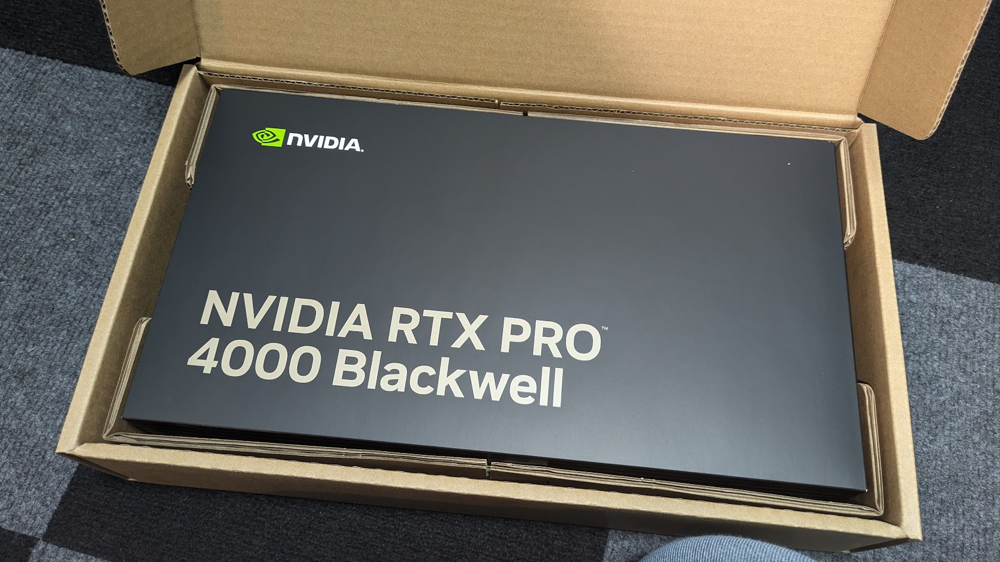

+++
date = '2025-11-29T21:00:00+09:00'
draft = false
title = 'NVIDIA Isaac Sim with NVIDIA RTX PRO 4000 Blackwell'
+++


## NVIDIA Isaac Sim with NVIDIA RTX PRO 4000 Blackwell: My New Robot Playground

So, I finally did it.
I caved in and bought the **NVIDIA RTX PRO 4000 Blackwell** GPU for my workstation.
And yes, I’ll admit it: the main reason was that I wanted to generate some _really_ big, high‑quality anime images (you know what I mean, lol).


But once I got it, I realized this thing is basically a tiny AI supercomputer, and it can run way more than just image generation, like **NVIDIA Isaac Sim**, which is my go‑to tool for robotics simulation and AI experiments.

In this post, I’ll walk you through my setup, the fun (and slightly painful) driver dance,
and how I finally got Isaac Sim 5.1 running smoothly on this shiny new Blackwell beast.

### Why I Bought the RTX PRO 4000 Blackwell

I’ve been using Stable Diffusion and similar tools for a while,
but with my old RTX 3060 Ti, generating a 4K anime image with a good model is impossible,
even if 1K image is quite impossible and sometimes my GPU would scream in protest.

When NVIDIA announced the RTX PRO 4000 Blackwell, I saw the specs: 24 GB of VRAM, Blackwell architecture, and insane tensor performance for generative AI.
I thought: “This is the card that can finally let me generate those huge, detailed anime scenes in seconds, while still being powerful enough for serious robotics work”.

So, after a lot of internal debate (and checking my bank account), I pulled the trigger.



### My Dual‑GPU Setup: Blackwell + 3060 Ti

Instead of just replacing my old GPU, I decided to go for a **dual‑GPU setup**:

- **NVIDIA RTX PRO 4000 Blackwell** → Dedicated to AI, generative models, and Isaac Sim
- **NVIDIA GeForce RTX 3060 Ti** → Handles gaming, general desktop, and display output

This way, I can:

- Run Isaac Sim and heavy AI workloads on the Blackwell without affecting my gaming FPS
- Keep my existing games and daily apps running smoothly on the 3060 Ti
- Use the Blackwell’s 24 GB VRAM for large models and high‑res simulations

Physically, I just installed the RTX PRO 4000 Blackwell in a PCIe x16 slot, connected it to power, and left the 3060 Ti in its place.
In BIOS, I set the 3060 Ti as the primary display GPU, so my monitors stay on it while the Blackwell crunches numbers in the background.


### The Driver Dance: One Version to Rule Them Both

Here’s where things got a little spicy.
The RTX PRO 4000 Blackwell is a very new workstation GPU, and the recommended driver version for Isaac Sim 4.5 is **535.x**, which doesn’t support Blackwell yet.

But there’s a catch: **you can’t run different NVIDIA driver versions for two GPUs on the same system**.
You have to pick one driver version that works for both cards.

So I had to:

1. Uninstall the old 535 driver completely
2. Install a newer driver that supports both the RTX PRO 4000 Blackwell and my RTX 3060 Ti
3. Test stability with both gaming and Isaac Sim workloads

After some trial and error (and a few crashes), I settled on **NVIDIA driver version 580.105.08**. This version:

- Fully supports the RTX PRO 4000 Blackwell
- Works fine with the RTX 3060 Ti for gaming and display
- Is compatible with Isaac Sim 5.1, which is what I ended up using

Pro tip: Always check the [Isaac Sim Requirements page](https://docs.isaacsim.omniverse.nvidia.com/latest/installation/requirements.html)
to see which driver version is recommended for your Isaac Sim version.


PS. You can find full documentation abuot NVIDIA Driver Installation Guide [from here](https://docs.nvidia.com/datacenter/tesla/driver-installation-guide/ubuntu.html).

PSS: it seem like the first RTX PRO 4000 Blackwell supported version is [570.169](https://download.nvidia.com/XFree86/Linux-x86_64/570.169/README/supportedchips.html).

### What Is NVIDIA Isaac Sim? (In a Nutshell)

For those who aren’t deep into robotics yet, **NVIDIA Isaac Sim** is a high‑fidelity robotics simulator built on NVIDIA Omniverse.
It lets you:

- Create realistic 3D environments (factories, warehouses, labs, etc.)
- Simulate robots (UR5, Panda, custom robots) with physics and sensors
- Generate synthetic data (RGB, depth, LiDAR, IMU) for training AI models
- Test navigation, manipulation, and reinforcement learning policies before deploying to real robots

In short: it’s like a “game engine for robots,” but with real physics, sensors, and AI integration.

### Installing Isaac Sim on a Local PC (Step by Step)

Here’s how I installed Isaac Sim on my Linux workstation (the steps are similar on Windows):

#### 1. Check System Requirements

Before installing, I made sure my system met the requirements:

- OS: Ubuntu 22.04 / 24.04 (or Windows 10/11)
- CPU: Intel Core i7 / AMD Ryzen 7 or better
- RAM: 32 GB minimum, 64 GB recommended
- GPU: RTX 4080 / RTX PRO 4000 Blackwell or better, with 16+ GB VRAM
- Storage: 50+ GB SSD for the base install, more if you plan to run large scenes

#### 2. Download Isaac Sim

I went to the official Isaac Sim download page and grabbed the **standalone workstation version** for Linux.
I chose the `.zip` package so I could install it in a custom location.

#### 3. Extract and Run the Installer

In the terminal, I did something like this:

```bash
mkdir ~/isaacsim
cd ~/Downloads
unzip "isaac-sim-standalone-5.1.0-linux-x86_64.zip" -d ~/isaacsim
cd ~/isaacsim
./post_install.sh
./isaac-sim.selector.sh
```

This creates the Isaac Sim App Selector, where I can choose which version and extensions to run.

#### 4. Launch Isaac Sim

In the App Selector, I selected **Isaac Sim Full** and clicked **START**.
The first launch takes a while because it’s warming up the shader cache, but after that, it starts much faster.

### The Isaac Sim 4.5 vs. 5.1 Problem

Here’s the big gotcha I ran into: **Isaac Sim 4.5 officially recommends driver version 535**,
but that driver doesn’t support the RTX PRO 4000 Blackwell yet.

So, if you try to run Isaac Sim 4.5 on a Blackwell GPU with a newer driver, you’ll likely see:

- Poor performance
- Crashes or rendering issues
- Missing features or extensions

The solution? **Skip Isaac Sim 4.5 and go straight to Isaac Sim 5.0 or later**.
Isaac Sim 5.1 is designed to work with newer GPUs and drivers, including Blackwell.

### Reinstalling from 4.5 to 5.1, and "voila!"

Since I had been using Isaac Sim 4.5 before, I decided to do a clean reinstall:

1. Backed up my important scenes and configs
2. Removed the old Isaac Sim 4.5 installation folder
3. Downloaded Isaac Sim 5.1 and installed it fresh in `~/isaacsim`
4. Ran `./post_install.sh` and `./isaac-sim.selector.sh` to set it up
5. [In case of 3D rendering is not working properly](https://forums.developer.nvidia.com/t/isaac-sim-viewport-turns-black-after-a-short-time-controller-initially-works-then-only-black-screen/350701/6), set multi-GPU option to false with isaacsim setting or `export CUDA_VISIBLE_DEVIES=<your gpu id>` or run `./isaac-sim.sh --active_multi_gpu=false --/renderer/activeGpu=<your gpu id>`. If it still not working, try to downgrade the driver version below [580](https://forums.developer.nvidia.com/t/isaac-sim-black-viewport/345744/4).

After that, I launched Isaac Sim 5.1, and… **voila!** Everything worked smoothly:

- The Blackwell GPU was fully utilized
- Rendering was buttery smooth, even in complex scenes
- All the Isaac Sim extensions (ROS2 bridge, Isaac Lab, etc.) loaded without issues

### Tips for Running Isaac Sim 5.1 on RTX PRO 4000 Blackwell

If you’re setting up a similar system, here are a few tips that helped me:

#### 1. Use the Compatibility Checker

Isaac Sim includes a **Compatibility Checker** tool that verifies your GPU, driver, CPU, RAM, and storage.
Run it before launching the full app to catch any issues early.


#### 2. Warm Up the Shader Cache

The first time you run Isaac Sim, it can take 5–10 minutes to warm up the shader cache. After that, startup is much faster.
If things feel slow, let it run for a few minutes and then restart.

#### 3. Use the Right Isaac Sim Version

For RTX PRO 4000 Blackwell, stick with **Isaac Sim 5.0 or later**.
Isaac Sim 4.5 is great for older GPUs, but it’s not the best choice for Blackwell.

#### 4. Offload Heavy Work to the Blackwell

In your Isaac Sim projects, make sure to:

- Use the RTX PRO 4000 Blackwell for rendering and simulation
- Keep the RTX 3060 Ti for display and lighter tasks
- Monitor GPU usage with tools like `nvidia-smi` to balance the load


### Final Thoughts: Why This Setup Rocks

Upgrading to the RTX PRO 4000 Blackwell has been a game‑changer for me.
Now I can:

- Generate **huge** anime images in seconds, not minutes (May be I should will make the blog about that in the next time?)
- Run Isaac Sim 5.1 with complex scenes and multiple robots at high frame rates
- Experiment with large models and reinforcement learning without constantly hitting VRAM limits

If you’re planning a similar dual‑GPU setup (Blackwell for AI + an older GPU for gaming), my advice is:

- Pick a driver version that supports both GPUs (I used 580.105.08)
- Use Isaac Sim 5.0+ for Blackwell GPUs
- And don’t forget to enjoy those big, beautiful anime images along the way, hehe

Happy simulating (and generating)!


