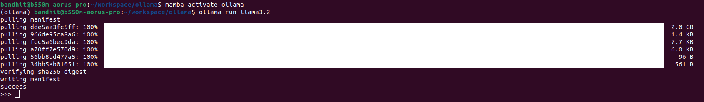
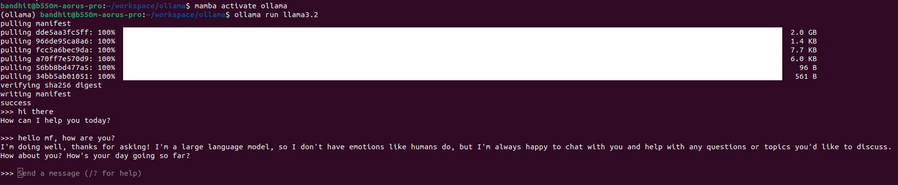
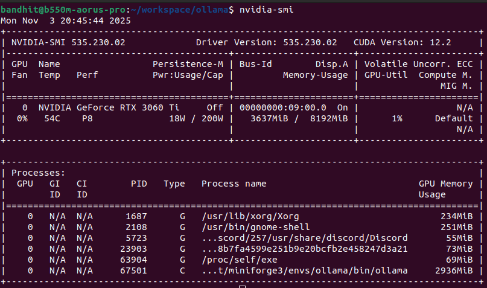
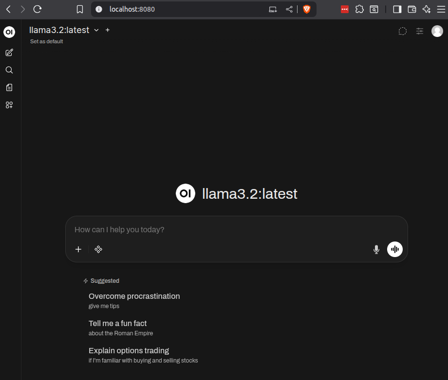
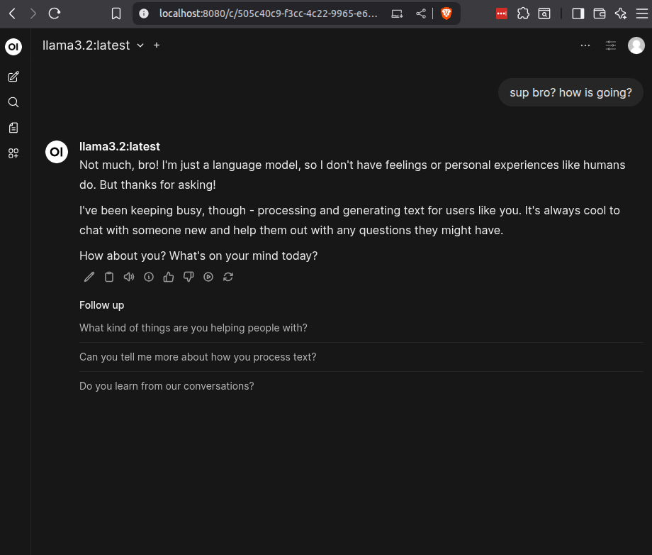

+++
date = '2025-11-03T20:00:00+09:00'
draft = false
title = 'Run Ollama Locally with a Web UI'
+++

## Motivation

I saw this recently: [PewDiePie built his own chat app to run LLMs locally on his machine.](https://www.youtube.com/watch?v=qw4fDU18RcU)
And also, I’ve spent countless hours roasting my GPU with AAA games-might as well make it do something useful for a change! Have you ever wanted to play with large language models (LLMs) right on your own computer, without relying on the cloud? Enter Ollama, a nifty open-source tool that lets you run powerful AI models locally!


### Install Ollama on Your Machine

Ollama works on Linux, macOS, and Windows. The easiest way to install on Linux or macOS is to open your terminal and run:

```bash
curl -fsSL https://ollama.com/install.sh | sh
```

Windows users can download the installer directly from Ollama's official website or run it inside WSL2 for more control.

After installation, verify it’s all set:

```bash
ollama -v
```

You should see the version printed out.

Of course, you can install `ollama` on `mamba` as well, matter of preference.
To install it using `mamba` CLI starting from creating a conda environment, you can follow these steps:

Create a new conda environment:

```bash
mamba create -n ollama_env -y
```

Activate the new environment:

```bash
mamba activate ollama_env
```

Install Hugo using mamba from the conda-forge channel:

```bash
mamba install -c conda-forge ollama -y
```

### Pick and Pull Your Favorite AI Model

Ollama has a built-in repository of open models like Llama 3, Mistral, and Phi-4.

This is some popular Ollama models with their size and CLI names, based on the most recent data available:

| Model Name              | Size  | CLI Name            |
| ----------------------- | ----- | ------------------- |
| Gemma 3 (4B)            | 3.3GB | `gemma3`            |
| DeepSeek-R1 (7B)        | 4.7GB | `deepseek-r1`       |
| Llama 4 (109B)          | 67GB  | `llama4:scout`      |
| Llama 3.3 (70B)         | 43GB  | `llama3.3`          |
| Llama 3.2 (3B)          | 2.0GB | `llama3.2`          |
| Llama 3.1 (8B)          | 4.7GB | `llama3.1`          |
| Phi 4 (14B)             | 9.1GB | `phi4`              |
| Mistral (7B)            | 4.1GB | `mistral`           |
| Llama 2 Uncensored (7B) | 3.8GB | `llama2-uncensored` |
| Granite-3.3 (8B)        | 4.9GB | `granite3.3`        |

Want to try Llama 3.2, for example?

Firstly, run:

```bash
ollama serve
```

Next, open an another terminal, run:

```bash
ollama run llama3.2
```

This will download and launch the model on your machine.
Be patient; these files can be a couple of gigabytes!



At this point, you can start chat to your Llama 3.2 via the current terminal here:



Pro. tips, if you are using NVIDIA GPU, you `nvidia-smi` to check resource usage on your GPU.



From above, memory usage is 3637MiB of 8192MiB, since Llama 3.2 model size is just 2.0GB so it be fine for now.

### Set Up the Open WebUI Front-End

While Ollama runs models via command line, Open WebUI adds a user-friendly browser interface.

Here’s how:

- Make sure you have Docker installed.
- Run the Open WebUI Docker container with:

```bash
docker run --network=host -p 3000:8080 -e WEBUI_AUTH=False -e OLLAMA_BASE_URL=http://127.0.0.1:11434 -v my-open-webui:/app/backend/data --name open-webui ghcr.io/open-webui/open-webui:main
```

Now, open your browser and go to `http://localhost:8080/`.
You can now chat with your Ollama-powered LLM through the web!





### Chat, Experiment, and Have Fun

Use the web UI to try prompts, experiment with different models, or even upload documents for processing.
Running AI locally means your data stays private, and you get full control over customization.

Running Ollama locally is like having a mini AI research lab right on your desk.
Whether you're a developer, hobbyist, or just curious about AI, it’s a rewarding experience to see LLMs work in real-time on your own machine.

Happy AI-ing!
